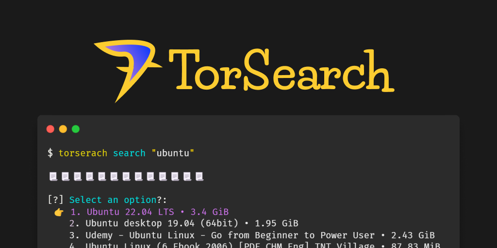
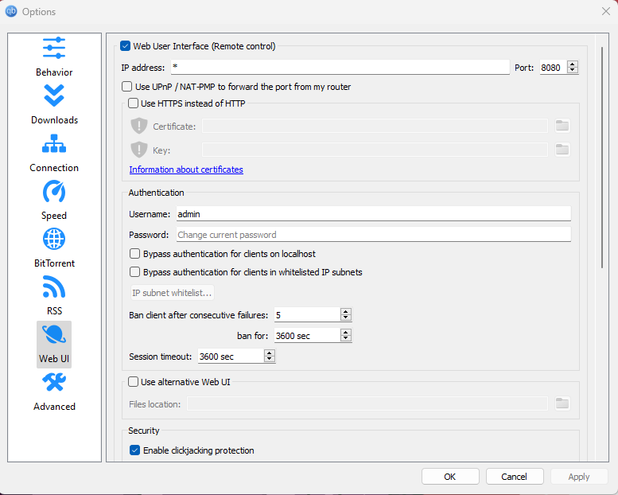

[](https://github.com/ShubheshDixit/torsearch)

# torsearch

A tool designed to help in finding torrent files on the internet gracefully. Can also download files when coupled with any torrent client like qBittorrent.  


## Build Using Pyinstaller

```bash
pyinstaller --noconfirm --onefile --console --icon "./assets/torsearch_logo_192.ico" --name "torsearch" --add-data "./torsearch/src/torsearch;."  "./torsearch/src/torsearch/__main__.py"
```

## Usage

```bash
 $ torsearch search [SEARCH_TERM] -s [SOURCE_NUMBER] -p [PAGE_NUMBER]
```

## Download Support
Download [qBittorrent](https://www.qbittorrent.org/download.php) client and allow remote connections (Web User Interface).

[](https://www.qbittorrent.org/download.php) 
